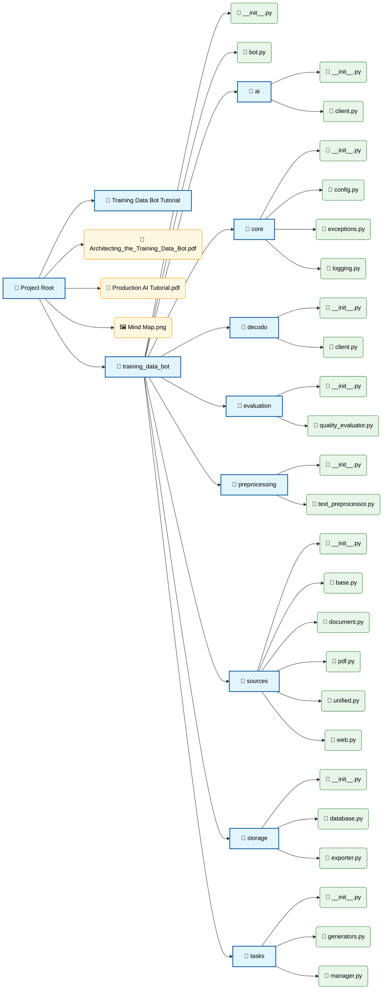

# Training Data Bot

Training Data Bot helps you turn raw documents into clean training datasets for LLM fine-tuning.

It supports mixed input sources (PDF, text files, folders, URLs), generates multiple task-style examples, scores quality, and exports the result in common formats.

---

## Why this project is useful

People often have useful content spread across manuals, notes, web pages, and internal docs, but that content is not ready for model training.

This project helps by:

1. **Collecting content automatically** from files, directories, and websites.
2. **Converting content into training examples** (QA, classification, summarization).
3. **Filtering low-quality examples** using quality scoring.
4. **Exporting a dataset** in JSONL/JSON/CSV for downstream ML workflows.

In simple terms: it saves time and gives teams a repeatable pipeline instead of manual copy-paste dataset creation.

---

## How the project works (pipeline)

The main orchestrator is `TrainingDataBot`. It runs this workflow:

1. **Load documents**
  - `UnifiedLoader` detects input type and routes to:
    - `PDFLoader`
    - `DocumentLoader`
    - `WebLoader`

2. **Preprocess text**
  - `TextPreprocessor` chunks each document into overlapping text segments.

3. **Generate training tasks**
  - `TaskManager` applies task generators:
    - QA generation
    - Classification
    - Summarization

4. **Evaluate quality**
  - `QualityEvaluator` scores dataset quality and returns a `QualityReport`.
  - Optional quality filtering removes weaker examples.

5. **Export dataset**
  - `DatasetExporter` writes output as `jsonl`, `json`, or `csv`.
  - Optional split export for train/validation/test.

---

## Project structure (high level)

- `training_data_bot/bot.py` → main orchestrator (`TrainingDataBot`)
- `training_data_bot/sources/` → file/pdf/web loading
- `training_data_bot/preprocessing/` → chunking and text preparation
- `training_data_bot/tasks/` → training example generation
- `training_data_bot/evaluation/` → quality scoring
- `training_data_bot/storage/` → dataset exporting and persistence helpers
- `training_data_bot/models.py` → core data models

---

## Step-by-step: how to run this project

## 1) Open terminal in project root

Make sure your terminal is inside:

`D:\Training_Data_Bot-main`

## 2) Create a virtual environment

### Windows PowerShell

```powershell
python -m venv .venv
```

## 3) Activate the environment

### Windows PowerShell

```powershell
.venv\Scripts\Activate.ps1
```

If PowerShell blocks script execution, run once:

```powershell
Set-ExecutionPolicy -Scope Process -ExecutionPolicy Bypass
```

Then activate again.

## 4) Install dependencies

```powershell
pip install -r requirements.txt
```

## 5) Run a quick end-to-end example

Create a file named `run_example.py` in the project root and paste:

```python
import asyncio
from training_data_bot import TrainingDataBot


async def main():
   async with TrainingDataBot() as bot:
      documents = await bot.load_documents([
        "docs/manual.pdf",
        "docs/notes.txt",
        "https://example.com/help"
      ])

      dataset = await bot.process_documents(
        documents=documents,
        task_types=None,
        quality_filter=True,
        chunk_size=800,
        overlap=120,
        quality_threshold=0.65,
      )

      report = await bot.evaluate_dataset(dataset)
      print("Quality score:", report.overall_score)
      print("Passed:", report.passed)

      output_path = await bot.export_dataset(
        dataset=dataset,
        output_path="output/training_data.jsonl",
        format="jsonl",
        split_data=True,
      )

      print("Exported to:", output_path)
      print("Stats:", bot.get_statistics())


if __name__ == "__main__":
   asyncio.run(main())
```

Run it:

```powershell
python run_example.py
```

## 6) Check output

After a successful run, you should see dataset files under `output/`.

---

## Minimal usage API

```python
from training_data_bot import TrainingDataBot
```

Main methods:

- `load_documents(...)`
- `process_documents(...)`
- `evaluate_dataset(...)`
- `export_dataset(...)`
- `get_statistics()`

---

## Common real-world use cases

1. **Support chatbot training**
  - Convert help-center docs + FAQs into QA training examples.

2. **Internal knowledge assistant**
  - Transform company policies and manuals into structured fine-tuning data.

3. **Domain-specific model improvement**
  - Build a custom dataset from technical documentation in finance, legal, healthcare, etc.

4. **Data curation workflows for ML teams**
  - Standardize document-to-dataset preprocessing in one repeatable pipeline.

---

## Troubleshooting

- **Module import errors**
  - Confirm virtual environment is active before running Python.

- **No output examples generated**
  - Check that source files/URLs are valid and contain enough text.

- **Very few examples after filtering**
  - Lower `quality_threshold` or set `quality_filter=False`.

- **Path/file not found**
  - Use correct absolute/relative paths for your local files.

---

## Notes

- Current AI/Decodo clients are lightweight placeholders; the pipeline is designed to be extendable.
- The default generation/evaluation behavior is deterministic and tutorial-friendly.

---

## License

See `LICENSE`.



